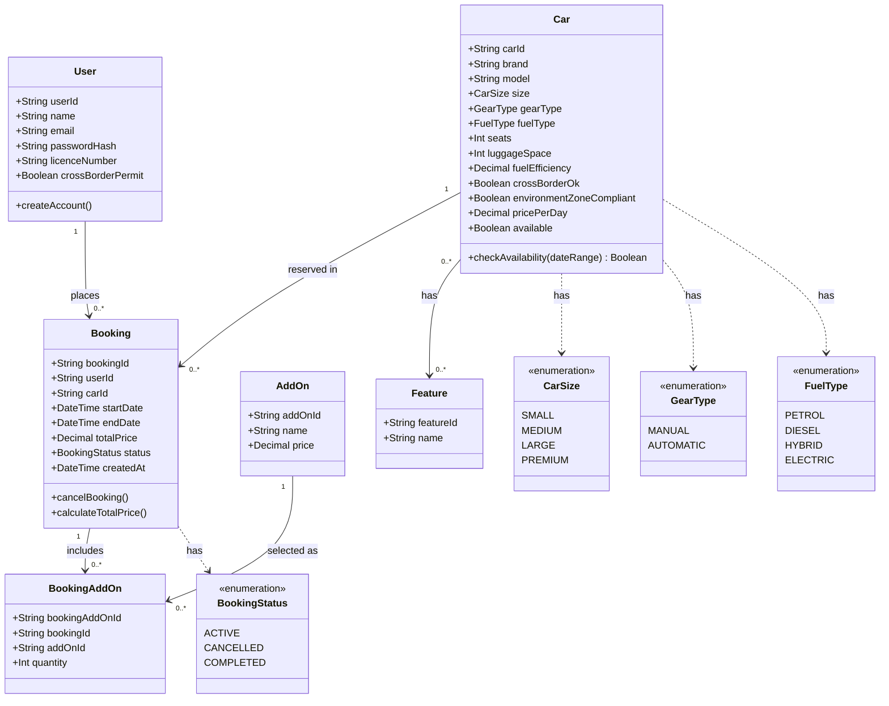

Car and AddOn represent reference data and read operations. Cache locally after fetching to cover offline browsing and filtering (US-1, US-2, US-4) per NFR-K1.

Booking and BookingAddOn represent write operations. Save locally as soon as actions occur (booking or cancelling) so US-3, US-5, and US-7 work offline as well. Add a `syncStatus` field (`pending`, `synced`, or `failed`) to track state.

User data is also cached locally for the active session, but account creation (US-6) is not complete until confirmed by the backend.

All local writes are processed through a background synchronisation queue with retry and backoff. This satisfies NFR-K2: offline booking does not lose data, but delays synchronisation.